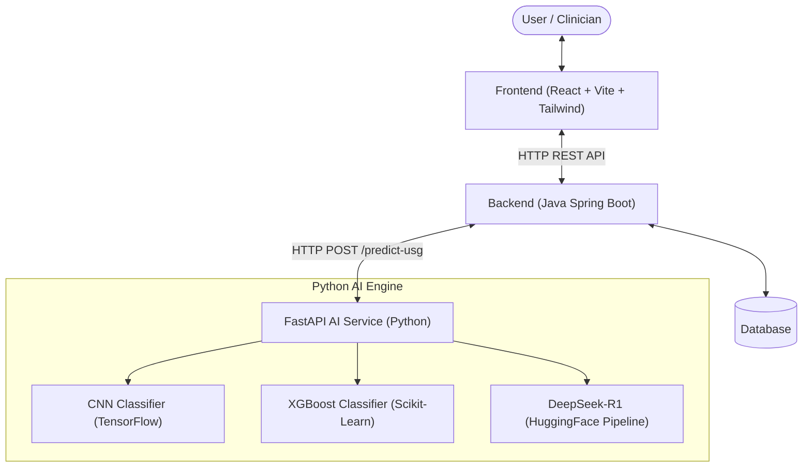

# OVAHealth AI: End-to-End PCOS Detection and Support System

OVAHealth AI is an advanced full-stack clinical decision support platform designed to assist in detecting and explaining Polycystic Ovary Syndrome (PCOS). By combining **Deep Learning** (CNNs for pelvic ultrasound images), **Machine Learning** (XGBoost for physical & clinical parameters), and **Generative AI** (DeepSeek-R1 for medical explanations), the platform offers a comprehensive, interpretable, and highly visual diagnostic workflow.

---

## 🌟 Key Features

- **Dual-Model Diagnostics**:
  - **Ultrasound Image Classifier**: A custom Convolutional Neural Network (CNN) trained to detect PCOS-infected ovaries from USG scans.
  - **Clinical Parameters Classifier**: An XGBoost model trained on patient clinical/physical metrics (Age, Weight, BMI, Menstrual Cycle Length) to estimate PCOS risk.
- **Explainable AI (XAI)**: Integrates the `DeepSeek-R1-Distill-Qwen-1.5B` LLM pipeline to automatically generate concise, natural language medical explanations explaining the reasoning behind ultrasound scan predictions.
- **AI Medical Assistant**: Interactive, context-aware chatbot helping users understand PCOS symptoms, risk factors, and next steps.
- **Analytics & History**: Beautiful dashboard tracking scan uploads, prediction trends, and historic data.
- **Enterprise-ready Backend**: Secure, transactional Java Spring Boot REST API for managing uploads, data persistence, and service routing.

---

## 🏗️ System Architecture

---

## 📊 Notebooks & Models

### 1. [PCOS Detection Based on Physical and Clinical Parameters.ipynb](file:///d:/java%20full%20stack%20project/OVAHealth%20AI/py%20ai/ai-service/notebooks/PCOS%20Detection%20Based%20on%20Physical%20and%20Clinical%20Parameters.ipynb)
- Performs exploratory data analysis (EDA), feature selection, and correlation analysis on patient clinical data.
- Trains, evaluates, and exports the **XGBoost Classifier** to detect PCOS likelihood using non-imaging indicators.

### 2. [GenAI-for-pcos-detection.ipynb](file:///d:/java%20full%20stack%20project/OVAHealth%20AI/py%20ai/ai-service/notebooks/GenAI-for-pcos-detection.ipynb)
- Orchestrates and tests the local pipeline implementation for text generation using Hugging Face pipelines and DeepSeek models.
- Designs medical explanation prompts based on binary diagnostic confidence levels.

### 3. CNN USG Classifier (`usg_model.keras`)
- **Input shape**: `(224, 224, 3)`
- **Target classes**: `infected` (PCOS detected, score close to `0`) and `noninfected` (Normal ovary, score close to `1`).
- **Layers**: 4 sequential Convolutional-Maxpooling blocks, a dense hidden layer (512 units) with dropout (0.5), and a final dense Sigmoid layer.

---

## 💾 Data Availability

- **Clinical Dataset**: The spreadsheet [`PCOS_data_without_infertility.xlsx`](file:///d:/java%20full%20stack%20project/OVAHealth%20AI/py%20ai/ai-service/dataset/PCOS_data_without_infertility.xlsx) utilized for the clinical model is included in this repository.
- **Ultrasound Image Dataset**: Due to file size constraints, the raw ultrasound image dataset is hosted externally and can be downloaded from:
  > 🔗 [Figshare PCOS Ultrasound Image Dataset](https://figshare.com/articles/dataset/PCOS_Dataset/27682557?file=50407062)

---

