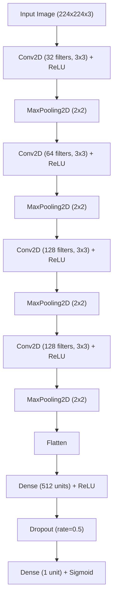

# PCOS USG Classification Model (`usg_model.keras`)

This directory contains the trained Convolutional Neural Network (CNN) model used by the Python AI service to detect Polycystic Ovary Syndrome (PCOS) from ultrasound (USG) scan images.

> [!NOTE]
> The weights file `usg_model.keras` is omitted from the Git repository due to GitHub's file size limits (approx. 110.8 MB). It must be trained locally or downloaded from our model registry before running the service.

## Model Overview

- **Task**: Binary image classification (Infected vs. Noninfected)
- **Input Size**: `(224, 224, 3)` (RGB ultrasound image)
- **Format**: Keras SavedModel (`.keras`)
- **Loss Function**: Binary Crossentropy
- **Optimizer**: Adam

---

## Output Classes

The model uses a sigmoid output layer returning a probability score between `0` and `1`:

| Output Score | Classification | Description |
| :--- | :--- | :--- |
| **Close to 0** | `infected` | PCOS detected |
| **Close to 1** | `noninfected` | Healthy ovary (No PCOS detected) |

---

## Model Architecture

The model is built sequentially with 4 convolutional blocks followed by dense layers:



---

## Training the Model Locally

To generate or retrain the `usg_model.keras` file:

1. Place your training dataset in `py ai/ai-service/dataset/PCOS/infected/` and `py ai/ai-service/dataset/PCOS/noninfected/`.
2. Run the training script:
   ```bash
   python train_model.py
   ```
3. The script will automatically:
   - Split your dataset into training, validation, and testing sets under `PCOS_organized/`.
   - Preprocess images to `(224, 224)` and normalize pixel values.
   - Train the model for `10` epochs.
   - Save the trained weights to [`py ai/ai-service/model/usg_model.keras`](file:///d:/java%20full%20stack%20project/OVAHealth%20AI/py%20ai/ai-service/model/usg_model.keras).

